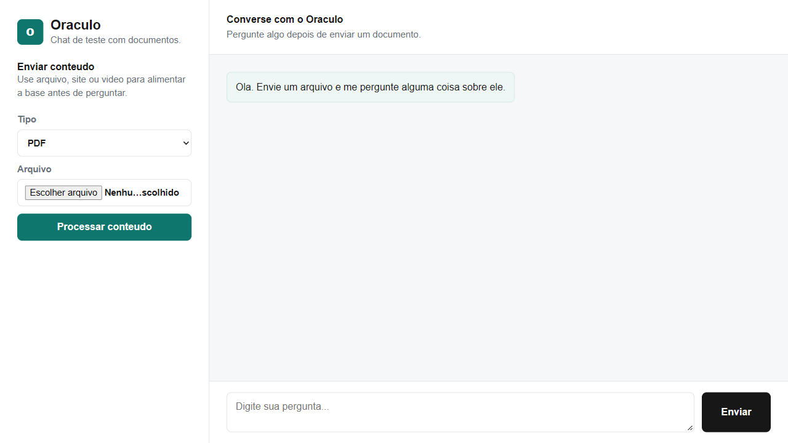

# Oráculo

Web chat that lets you talk to an LLM using the content of **files, websites or YouTube videos** as context.




## Features

- Interactive AI chat with streaming responses
- Reads **PDF, CSV and TXT** files
- Analyzes **websites**
- Extracts content from **YouTube videos**
- Answers **only from the loaded source** (simple RAG)
- Switch model and provider on the fly
- Clear-conversation button

## How it works

1. The user uploads a file or pastes a link.
2. The system loads the source, splits it into chunks and indexes it in Qdrant.
3. The user asks questions in the chat.
4. The agent retrieves the relevant chunks and answers based on them.

## Stack

| Layer | Technology |
|---|---|
| Backend | Python, Django |
| LLM orchestration | Agno |
| Retrieval | Qdrant |
| Model provider | Groq API |

## Running locally

Requires Python 3.12+ (Django 6) and a [Groq](https://console.groq.com/) API key. Documents are indexed in [Qdrant](https://qdrant.tech/), which must be running before the app starts.

```bash
git clone https://github.com/LorenzoMarty/Oraculo-Chatbot.git
cd Oraculo-Chatbot
python -m venv .venv
source .venv/bin/activate          # Windows: .venv\Scripts\activate
pip install -r requirements.txt
```

Start Qdrant (the app expects it at `http://localhost:6333`, override with `QDRANT_URL`):

```bash
docker run -p 6333:6333 qdrant/qdrant
```

Create a `.env` file:

```
GROQ_API_KEY=your_key_here
```

Then start the server:

```bash
python manage.py runserver
```

The original Portuguese README is kept in [docs/README.pt-BR.md](docs/README.pt-BR.md).

## License

[MIT](LICENSE)

## Author

**Lorenzo Marty** — [GitHub](https://github.com/LorenzoMarty)
